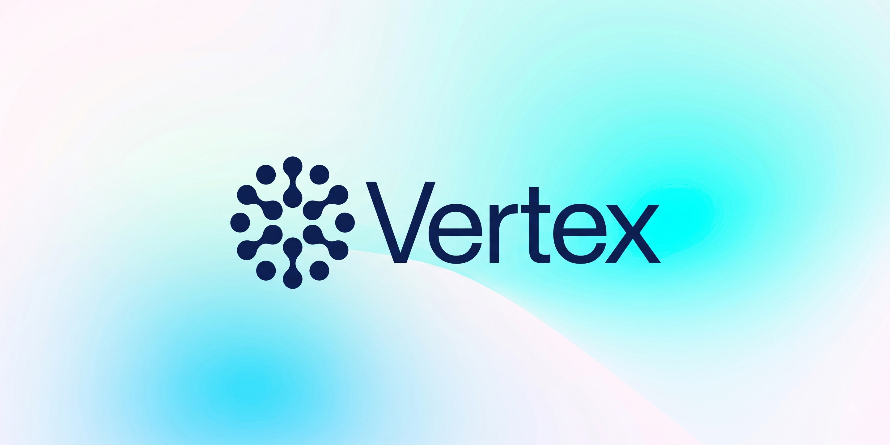

<p align="center">
  
</p>

<p align="center">
  
  
  
  
  
  
</p>

<h3 align="center">A statically typed systems programming language with ARC memory, ownership-aware receiver methods, first-class GPU compute kernels, and native C++ modules, compiled straight to native binaries with no external toolchain.</h3>

<p align="center">
  <a href="https://github.com/vertex-language/vsc">Compiler (<code>vsc</code>)</a> ·
  <a href="https://github.com/vertex-language/vcx">C++ Compiler (<code>vcx</code>)</a> ·
  <a href="https://github.com/vertex-language/ir">Vertex IR (<code>vir</code>)</a> ·
  <a href="https://github.com/vertex-language/vsc/blob/main/docs/vertex_spec.md">Language Specification</a> ·
  <a href="https://github.com/vertex-language/vscode-vertex">VS Code Extension</a>
</p>

---

## Overview

**Vertex** is a statically typed systems programming language engineered for high-performance computing, systems infrastructure, and modern AI/ML workloads. It unites the safety and ergonomics of automatic reference counting (ARC) and value semantics with low-level hardware control, first-class GPU compute kernels, and seamless C++ interoperability.

Vertex source lives in `.vs` files and compiles down to native executables via a unified in-process toolchain.

```swift
package main

import (
    "gpu"
    "time"
)

struct Point {
    var x: float32
    var y: float32
}

// Receiver method with explicit ownership
func (p: borrowing Point) DistanceSquared() -> float32 {
    return p.x * p.x + p.y * p.y
}

func (p: inout Point) Scale(by factor: float32) {
    p.x *= factor
    p.y *= factor
}

// Element GPU kernel: compiled for the device and callable via Map
func normalize(_ x: float32) kernel -> float32 {
    return x > 0 ? x : 0.0
}

func main() async -> int32 {
    var pt = Point(x: 3.0, y: 4.0)
    pt.Scale(by: 2.0)
    print("Distance squared: \(pt.DistanceSquared())")  // 100.0

    // Compute on Apple Metal or CPU fallback
    let device = gpu.Default()
    let buffer = try await device.Upload([float32]([-1.5, 0.0, 2.5, 5.0]))
    let activated = try await normalize.Map(buffer)
    print("GPU result: \(try await activated.Download())") // [0.0, 0.0, 2.5, 5.0]

    return 0
}
```

### Key Pillars

- **Zero External Toolchain:** The compiler, [`vsc`](https://github.com/vertex-language/vsc), owns the entire compilation lifecycle in a single process: lexical analysis, recursive-descent parsing, type checking, ownership verification, definite initialization, lowering to Vertex IR ([`ir`](https://github.com/vertex-language/ir)), machine code emission, and direct binary linking (Mach-O, PE/COFF, ELF). No clang, gcc, llc, or system linkers required.
- **First-Class GPU Compute:** GPU kernels (`func f(...) kernel`) are declared directly in Vertex alongside host code. They are statically checked, lowered to device targets (Metal AIR on macOS, CPU fibers for testing, PTX for NVIDIA, AMDGPU for AMD), and launched through type-safe generated methods (`Launch`, `Map`).
- **In-Process Native C++:** When a package needs direct OS facilities, it carries a C++20 named module (`export module ...`) inside its folder. The compiler invokes [`vcx`](https://github.com/vertex-language/vcx) in-process, exporting declarations directly into Vertex without C headers, binding generators, or symbol attributes.
- **Structured Concurrency:** Lightweight `async`/`await`, `async let`, task groups, and actors run on a dedicated non-blocking cooperative task executor linked into every program. Sockets, file descriptors, and timers yield automatically on `would block`.
- **A Vast, Self-Contained Standard Library:** Over 30 first-class packages with **zero third-party dependencies**. Everything from TLS 1.3, HTTP/3, and QUIC to a pure-Vertex browser engine, an ECMAScript JavaScript runtime, and local LLM/TTS neural network inference is built directly into the ecosystem.

---

## Quick Start

### 1. Build the Toolchain

The Vertex compiler is written in Go (Go 1.23+ required):

```bash
git clone https://github.com/vertex-language/vsc
cd vsc/cmd && go build -o ~/bin/vsc ./vsc
export PATH="$HOME/bin:$PATH"
```

### 2. Run Your First Program

Top-level statements execute directly:

```swift
// hello.vs
let name = "Vertex"
print("Hello, \(name)!")
```

Run directly from source:

```bash
vsc run hello.vs
```

Or build a standalone native executable:

```bash
vsc build -o hello hello.vs
./hello
```

---

## Language Features

### Types & Values

Primitive types have concise, lower-case spellings:

| Type | Description |
| :--- | :--- |
| `bool` | Boolean value (`true` or `false`) |
| `int`, `int8`, `int16`, `int32`, `int64` | Signed integers (`int` matches machine pointer width) |
| `uint`, `uint8`, `uint16`, `uint32`, `uint64` | Unsigned integers (`uint` matches machine pointer width) |
| `float32` (`float`), `float64` (`double`) | IEEE 754 standard floating-point numbers |
| `float16`, `bfloat16` | 16-bit half-precision floats (supported on CPU and GPU devices) |
| `string`, `char` | UTF-8 encoded text and single extended grapheme clusters |
| `void`, `never`, `any` | Empty tuple, non-returning function return type, type-erased value |

Vertex provides value-semantic `struct`s, reference-semantic `class`es with ARC and `deinit`, payload-bearing `enum`s with exhaustive pattern matching, `protocol`s, and parametric generics.

### Explicit Receiver Ownership

Methods declared outside a type write the receiver's ownership explicitly:

```swift
struct Buffer {
    var bytes: [uint8]
}

// borrowing: Read-only access, no refcount modification or memory copies
func (b: borrowing Buffer) Size() -> int {
    return b.bytes.count
}

// inout: In-place mutable access
func (b: inout Buffer) Append(_ byte: uint8) {
    b.bytes.append(byte)
}

// consuming: Takes ownership of the value
func (b: consuming Buffer) IntoArray() -> [uint8] {
    return b.bytes
}
```

### Optional Call-Site Argument Labels

Labels can be omitted when call sites are unambiguous, preserving expressiveness without boilerplate:

```swift
func calculateOffset(base: int32, stride: int32) -> int32 {
    return base * stride
}

calculateOffset(base: 10, stride: 4)
calculateOffset(10, 4)                  // Identical call
```

### Enums & Pattern Matching

```swift
enum Result<T, E> {
    case ok(value: T)
    case error(code: E)
}

func handle(_ res: Result<string, int32>) {
    switch res {
    case .ok(let msg):
        print("Success: \(msg)")
    case .error(let code):
        print("Failed with error code \(code)")
    }
}
```

### Structured Concurrency

Vertex programs execute asynchronous tasks on a cooperative non-blocking executor. Worker threads are never blocked by OS I/O:

```swift
func fetchMetrics(nodeId: int) async -> int {
    // Non-blocking asynchronous operation
    return nodeId * 42
}

// Concurrent child tasks with async let
async let primary = fetchMetrics(nodeId: 1)
async let replica = fetchMetrics(nodeId: 2)
let sum = await primary + await replica

// Dynamic task groups
let aggregate = await withTaskGroup(of: int.self) { group in
    for id in 1...8 {
        group.addTask { await fetchMetrics(nodeId: id) }
    }
    var total = 0
    for await value in group {
        total += value
    }
    return total
}

// Isolated mutable state with actors
actor SharedState {
    var count = 0
    func Increment() -> int {
        count += 1
        return count
    }
}
```

---

## First-Class GPU Compute

In Vertex, GPU kernels are written with the same syntax as host functions. Placing `kernel` on a function marks it for device execution:

- **Grid Kernels:** Return `Void`. Dispatched across a 1D, 2D, or 3D grid of work-items.
- **Element Kernels:** Return a value. Applied elementwise over data buffers via `.Map(...)`.

```swift
import "gpu"

// Grid kernel: parallel vector addition
func vectorAdd(_ a: gpu.Span<float32>, _ b: gpu.Span<float32>, _ out: gpu.MutableSpan<float32>) kernel {
    let idx = gpu.Index.x
    if idx < out.count {
        out[idx] = a[idx] + b[idx]
    }
}

// Workgroup reduction with barrier synchronization and wave shuffles
func parallelSum(_ input: gpu.Span<float32>, _ total: gpu.MutableSpan<float32>) kernel {
    let shared = gpu.Shared<float32>(count: 256)
    let local = gpu.LocalIndex.x
    let global = gpu.Index.x

    shared[local] = global < input.count ? input[global] : 0.0
    gpu.Barrier()

    var stride = gpu.GroupSize.x / 2
    while stride >= gpu.Wave.Size {
        if local < stride {
            shared[local] += shared[local + stride]
        }
        gpu.Barrier()
        stride /= 2
    }

    if local < gpu.Wave.Size {
        let sum = gpu.Wave.Sum(shared[local])
        if gpu.Wave.Lane == 0 {
            _ = gpu.Atomic.Add(total.Address(0), sum)
        }
    }
}
```

### What the Compiler Automates

1. **Typed Launches:** Every kernel automatically acquires a `.Launch(...)` method generated with exact argument types, and element kernels acquire `.Map(...)`.
2. **Device Analysis:** Any helper function called by a kernel is automatically compiled into the device module.
3. **Safety & Bounds Verification:** Heap allocations, dynamic dispatch, unchecked globals, and I/O are disallowed inside kernels with diagnostic tracebacks.
4. **Multi-Target Lowering:**
   - **Metal (macOS):** Lowered to Apple AIR and embedded as native Metal libraries.
   - **CPU:** Fiber-based execution per core. Barriers translate to stack switches, providing an identical testing oracle anywhere.
   - **PTX & AMDGPU:** Target-independent VIR lowerings for NVIDIA and AMD GPUs.

---

## Native C++ in Packages (`vcx`)

When interacting with platform APIs or OS kernels, a package folder can contain C++20 named modules alongside `.vs` files. The compiler compiles them in-process via [`vcx`](https://github.com/vertex-language/vcx):

```cpp
// geo/math.cpp
module;
#include <cmath>
#pragma vertex library("m")
export module geo.math;

export namespace math {
    double FastHypot(double x, double y) noexcept {
        return std::hypot(x, y);
    }
}
```

Call the exported symbols directly in Vertex without bindings or header declarations:

```swift
// geo/main.vs
package main

import "github.com/you/geo/math"

let dist = math.FastHypot(3.0, 4.0)
print("Distance: \(dist)") // 5.0
```

On Apple platforms, Objective-C++ files (`.mm`) compile with ARC enabled, allowing direct interaction with AppKit, UIKit, and Metal framework APIs.

---

## The Standard Library: 30 First-Class Packages

The Vertex standard library adheres to three architectural principles:
1. **No third-party libraries:** No vendored C/C++ dependencies (no OpenSSL, libpng, zlib, SQLite, or FreeType).
2. **Leverage stable OS interfaces:** Thin C++ modules for platform-provided facilities (sockets, windowing, audio).
3. **Pure Vertex for everything else:** Formats, parsers, protocols, engines, and cryptographic algorithms are pure `.vs`, delivering identical, reproducible behavior across all platforms.

Any repository containing a `vs.mod` on the system is recognized as a standard package:

```
import "fs"             // github.com/vertex-language/fs
import "net/http"       // github.com/vertex-language/net/http
import "gpu"            // github.com/vertex-language/gpu
```

### Standard Library Catalog

```
┌────────────────────────────────────────────────────────────────────────────────────────┐
│                                 THE VERTEX ECOSYSTEM                                   │
├──────────────────────────┬───────────────────────────┬─────────────────────────────────┤
│ Core Systems & Runtime   │ Data & Encodings          │ Networking, Web & UI            │
│  • fs, io, os, sync      │  • encoding, unicode      │  • net (tcp/udp/http/quic/rtc)  │
│  • time, gc, cli, log    │  • archive, compress      │  • web (html/css/layout/paint)  │
│                          │  • image, media, text     │  • js (ECMAScript engine)       │
│                          │                           │  • ui (window/webview)          │
├──────────────────────────┼───────────────────────────┼─────────────────────────────────┤
│ Security & Cryptography  │ Storage & Remote Services │ Accelerated Compute & AI        │
│  • crypto (TLS 1.3/AES)  │  • db (SQL/SQLite/Redis)  │  • gpu, tensor, nn              │
│  • hash (CRC/XXH3/FNV)   │  • remote (HF Hub / RDP)  │  • model (GGUF/SafeTensors)     │
│                          │                           │  • llm (Llama), tts (Kokoro)    │
│                          │                           │  • math (elementary & big int)  │
└──────────────────────────┴───────────────────────────┴─────────────────────────────────┘
```

#### 1. Core Systems & Runtime

| Package | Capabilities | Native OS Boundary |
| :--- | :--- | :--- |
| **[`os`](https://github.com/vertex-language/os)** | Process lifecycle (`process`), signal handling (`signal`), environment variables (`env`), system diagnostics (`host`), user identities (`user`), and VT100 terminal raw mode (`term`). | `os` POSIX / Win32 |
| **[`fs`](https://github.com/vertex-language/fs)** | File operations, recursive directory traversal, file metadata, in-memory virtual filesystems (`memory`), and memory-mapped files (`mmap`). | `fs`, `fs/mmap` |
| **[`io`](https://github.com/vertex-language/io)** | Zero-allocation streaming I/O abstractions: `Reader`, `Writer`, `Closer`, `Seeker` protocols, buffered streams, and cursor adapters. | Pure Vertex |
| **[`sync`](https://github.com/vertex-language/sync)** | Concurrency primitives, channels, synchronization barriers, and dedicated OS-thread worker pools. | Pure Vertex |
| **[`time`](https://github.com/vertex-language/time)** | Nanosecond monotonic instant, wall-clock timestamps, durations, tickers, and asynchronous timers. | `time` clock syscalls |
| **[`gc`](https://github.com/vertex-language/gc)** | Tracing garbage collection runtime: heap management, ephemeron tables, allocation barriers, root sets, and weak references. | Pure Vertex |
| **[`cli`](https://github.com/vertex-language/cli)** | Command-line parsing: subcommands, options, flags, environment fallbacks, help generation, and shell completions (Bash, Zsh, Fish). | Pure Vertex |
| **[`log`](https://github.com/vertex-language/log)** | High-throughput structured logging: key-value attributes, contextual child loggers, severity filters, and text / JSON formatters. | Pure Vertex |

#### 2. Data Formats, Encodings & Compression

| Package | Capabilities | Native OS Boundary |
| :--- | :--- | :--- |
| **[`encoding`](https://github.com/vertex-language/encoding)** | Serialization and wire protocols: streaming JSON parser/encoder, endian-aware binary, Hex, Base64, PEM, ASN.1, and XML. | Pure Vertex |
| **[`unicode`](https://github.com/vertex-language/unicode)** | Full Unicode 17.0 Character Database (UCD) properties, grapheme cluster segmentation, and pure Vertex UTF-8 and UTF-16 codecs. | Pure Vertex |
| **[`text`](https://github.com/vertex-language/text)** | Typography font parsing and OpenType glyph shaping (`font`), plus BPE and WordPiece neural model tokenizers (`tokenizer`). | `text/font` (CoreText / DirectWrite) |
| **[`archive`](https://github.com/vertex-language/archive)** | Archive formats: USTAR TAR (`tar`) and ZIP (`zip`) readers/writers composing directly with `io` streaming protocols. | Pure Vertex |
| **[`compress`](https://github.com/vertex-language/compress)** | Pure-Vertex compression: DEFLATE (RFC 1951), zlib (RFC 1950), gzip (RFC 1952), and high-speed LZ4 block compression. | Pure Vertex |
| **[`image`](https://github.com/vertex-language/image)** | Pixel models, 2D drawing rasters, color spaces, and pure-Vertex PNG decoding and encoding. | Pure Vertex |
| **[`media`](https://github.com/vertex-language/media)** | Audio processing: multi-channel sample buffers (`audio.Buffer`), format conversions, and WAV container reading/writing. | Pure Vertex |

#### 3. Networking, Web Engine & Scripting

| Package | Capabilities | Native OS Boundary |
| :--- | :--- | :--- |
| **[`net`](https://github.com/vertex-language/net)** | Full asynchronous networking stack: TCP (`tcp`), UDP (`udp`), URL parsing (`url`), HTTP/1.1, HTTP/2, HTTP/3 (`http`), WebSocket RFC 6455 (`websocket`), QUIC transport (`quic`), WebTransport, and complete WebRTC (`webrtc`, `ice`, `stun`, `turn`, `dtls`, `sctp`, `datachannel`). | `net/tcp`, `net/udp` non-blocking sockets |
| **[`web`](https://github.com/vertex-language/web)** | Complete browser engine written in pure Vertex: HTML5 parser (`html`), live DOM tree (`dom`), CSS3 parser & cascade (`css`, `cascade`), Flexbox and Grid layout (`layout`), and pixel painting (`paint`, `svg`). Renders headless or in a window. | Pure Vertex |
| **[`js`](https://github.com/vertex-language/js)** | ECMAScript standard JavaScript engine written in pure Vertex: lexer, recursive-descent parser, AST, scope analysis, Ignition-style bytecode compiler, VM interpreter with inline caches (IC), and `gc` integration. | Pure Vertex |
| **[`ui`](https://github.com/vertex-language/ui)** | Cross-platform windowing (`window`) with native event loops (macOS AppKit, Windows Win32, Android NativeActivity) and native web view rendering (`webview`). | `ui/window` (`.mm` on macOS, Win32 on Windows) |

#### 4. Security & Cryptography

| Package | Capabilities | Native OS Boundary |
| :--- | :--- | :--- |
| **[`crypto`](https://github.com/vertex-language/crypto)** | Cryptographic suite: AES (GCM, CBC, CTR), ChaCha20, ChaCha20-Poly1305, Poly1305, RSA, Curve25519 (X25519), SHA-256, SHA-512, SHA-1, MD5, HMAC, HKDF, TLS 1.3 / 1.2 client & server, DTLS, X.509 certificates, NTLM, and secure CSPRNG (`rand`). | `crypto/cert` (OS trust roots) |
| **[`hash`](https://github.com/vertex-language/hash)** | Non-cryptographic hashing algorithms: CRC-32, CRC-64, Adler-32, FNV-1/1a, and XXH3. | Pure Vertex |

#### 5. Databases & Remote Services

| Package | Capabilities | Native OS Boundary |
| :--- | :--- | :--- |
| **[`db`](https://github.com/vertex-language/db)** | SQL abstractions (`sql`), embedded pure-Vertex SQLite storage engine and B-tree file format parser (`sqlite`), and wire-protocol client drivers for PostgreSQL, MySQL, and Redis. | Pure Vertex |
| **[`remote`](https://github.com/vertex-language/remote)** | Remote services: Hugging Face Hub client (`hub`) for automated checkpoint resolution and downloading, and Remote Desktop Protocol (`rdp`) client/server. | Pure Vertex |

#### 6. Accelerated Compute & Machine Learning

| Package | Capabilities | Native OS Boundary |
| :--- | :--- | :--- |
| **[`gpu`](https://github.com/vertex-language/gpu)** | Accelerated compute primitives: parallel reductions, prefix scans, matrix multiplication (GEMM), FFTs, random streams, BVH traversal, attention kernels, and tensor dtypes. | Host runtime (Metal / CPU fibers) |
| **[`tensor`](https://github.com/vertex-language/tensor)** | Multi-dimensional strided tensor operations, broadcasting, memory layouts, shape transformations, and multi-device buffer allocations. | Pure Vertex + `gpu` |
| **[`nn`](https://github.com/vertex-language/nn)** | Neural network building blocks: Linear layers, quantized matrix weights (Q4_0, Q4_K_M), RMSNorm, LayerNorm, GatedMLP, Attention, and KV cache. | Pure Vertex + `gpu` |
| **[`model`](https://github.com/vertex-language/model)** | Universal machine learning model checkpoint loader: GGUF reader/writer, SafeTensors loader, and PyTorch format parser. | Pure Vertex |
| **[`llm`](https://github.com/vertex-language/llm)** | End-to-end Large Language Model inference engine: LLaMA family architecture, RoPE embeddings, KV cache management, and token generation on GPU or CPU. | Pure Vertex + `gpu` |
| **[`tts`](https://github.com/vertex-language/tts)** | Neural text-to-speech synthesis: Kokoro TTS model architecture, phonemization, mel spectrogram generation, and neural vocoder. | Pure Vertex + `gpu` |
| **[`math`](https://github.com/vertex-language/math)** | IEEE 754 elementary functions in single/double precision and arbitrary-precision integers and rationals (`big`). | Pure Vertex |

---

## Package Model & Workspaces

A package in Vertex is simply a folder. Every `.vs` file within it belongs to that package:

```
my-project/
├── vs.mod                   ← Module manifest
├── vs.sum                   ← Cryptographic dependency hashes
├── parser/
│   ├── parser.vs            ← package parser
│   └── parser_posix.cpp     ← Optional native C++ module
├── cmd/
│   └── app/
│       └── main.vs          ← Executable entrypoint (run with: vsc run app)
```

### Module Manifest (`vs.mod`)

```
module github.com/username/my-project

vertex 0.9
platform macos 14
```

### Multi-Repository Workspaces (`vs.work`)

When developing across multiple sibling checkouts simultaneously, create a `vs.work` file in their parent directory to redirect imports to local checkouts instead of the package cache:

```
vertex 0.9

use (
    ./net
    ./crypto
    ./gpu
    ./my-project
)
```

### Platform-Specific Source Files

Vertex uses file suffixes rather than preprocessor guards to target specific platforms:

- `_darwin.vs` / `_darwin.mm` (macOS, iOS)
- `_windows.vs` / `_windows.cpp` (Windows)
- `_android.vs` / `_android.cpp` (Android)
- `_posix.vs` / `_posix.cpp` (POSIX-compliant systems)
- `_arm64.vs` / `_amd64.vs` (Architecture specific)

---

## Toolchain Architecture

The Vertex toolchain compiles source down to native binaries in a unified pipeline:

```
    .vs source files                  .cpp / .mm native modules
           │                                      │
  Scanner, Lexer, Parser                 vcx: parse, type check
           │                                      │
    AST & Semantic Analysis ◄────── exports ──────┤ (C++20 module exports)
           │
   Definite Initialization & SIL Ownership
           │
   Lowering to Vertex IR (vir)
      ├── Machine lowerings ──► arm64 / amd64 encoder ──► Mach-O / PE / ELF Linker ──► Native Binary
      └── Kernel lowerings  ──► AIR (Metal) / CPU fibers / PTX / AMDGPU
```

### Sibling Repositories

| Repository | Purpose |
| :--- | :--- |
| **[`vsc`](https://github.com/vertex-language/vsc)** | The primary Vertex compiler and runtime driver. |
| **[`vcx`](https://github.com/vertex-language/vcx)** | The in-process C++ and Objective-C++ compiler (`v++`). |
| **[`ir`](https://github.com/vertex-language/ir)** | Vertex IR (`vir`), intermediate optimizations, and target lowerings. |
| **[`arm64`](https://github.com/vertex-language/arm64)** | 64-bit ARM instruction encoder. |
| **[`amd64`](https://github.com/vertex-language/amd64)** | x86-64 instruction encoder. |
| **[`i386`](https://github.com/vertex-language/i386)** | 32-bit x86 instruction encoder. |
| **[`macho`](https://github.com/vertex-language/macho)** | Mach-O object generator and native linker. |
| **[`pe`](https://github.com/vertex-language/pe)** | PE/COFF object generator and native linker. |
| **[`elf`](https://github.com/vertex-language/elf)** | ELF object generator and native linker. |
| **[`vscode-vertex`](https://github.com/vertex-language/vscode-vertex)** | Official Visual Studio Code language extension (syntax highlighting, diagnostics, formatting). |

### Supported Targets

| Target | Binary Format | Kernel Backends | Linking Strategy |
| :--- | :--- | :--- | :--- |
| `aarch64-macos` | Mach-O | Metal, CPU | macOS SDK (`libSystem.tbd`, system frameworks) |
| `aarch64-android` | ELF shared library | CPU | Android NDK NativeActivity runtime |
| `x86_64-windows` | PE/COFF | CPU | MSVC CRT (`libcmt`, `libucrt`) |
| `-freestanding` | Mach-O / ELF / PE | CPU | Bare metal; zero SDK or CRT dependencies |

---

## License

Vertex is licensed under the [MIT License](LICENSE).
